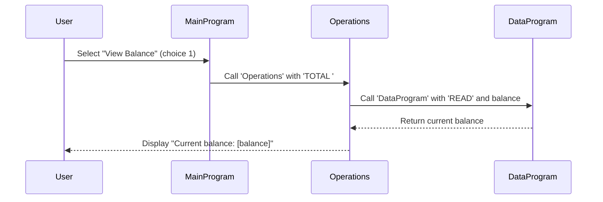

# COBOL Student Account Management System

This project contains a legacy COBOL-based system for managing student accounts. The system allows users to view account balances, credit accounts, and debit accounts through a simple command-line interface.

## COBOL Files Overview

### data.cob
**Purpose**: Handles persistent storage and retrieval of account balance data.

**Key Functions**:
- `READ`: Retrieves the current balance from storage.
- `WRITE`: Updates the balance in storage.

**Business Rules**:
- Maintains a single balance value for the student account.
- Initial balance is set to $1000.00.

### main.cob
**Purpose**: Serves as the main entry point and user interface for the account management system.

**Key Functions**:
- Displays a menu with options for account operations.
- Accepts user input for operation selection.
- Calls the appropriate operations based on user choice.
- Handles program exit.

**Business Rules**:
- Provides a loop-based menu system until the user chooses to exit.
- Validates user input (expects 1-4).

### operations.cob
**Purpose**: Implements the core business logic for account operations.

**Key Functions**:
- `TOTAL`: Displays the current account balance.
- `CREDIT`: Adds a specified amount to the account balance.
- `DEBIT`: Subtracts a specified amount from the account balance if sufficient funds are available.

**Business Rules**:
- **Credit Operation**: Allows adding any positive amount to the balance without restrictions.
- **Debit Operation**: Only allows debiting if the account balance is greater than or equal to the debit amount. Displays "Insufficient funds" error otherwise.
- All operations update and persist the balance through the data module.
- Amounts are handled as decimal values (up to 6 digits before decimal, 2 after).

## Sequence Diagram

The following sequence diagram illustrates the data flow for viewing the account balance:

